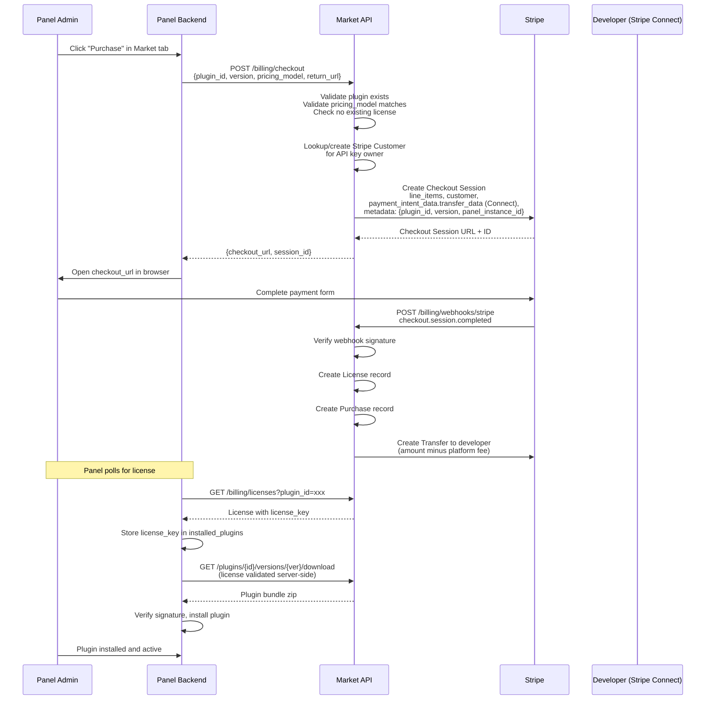
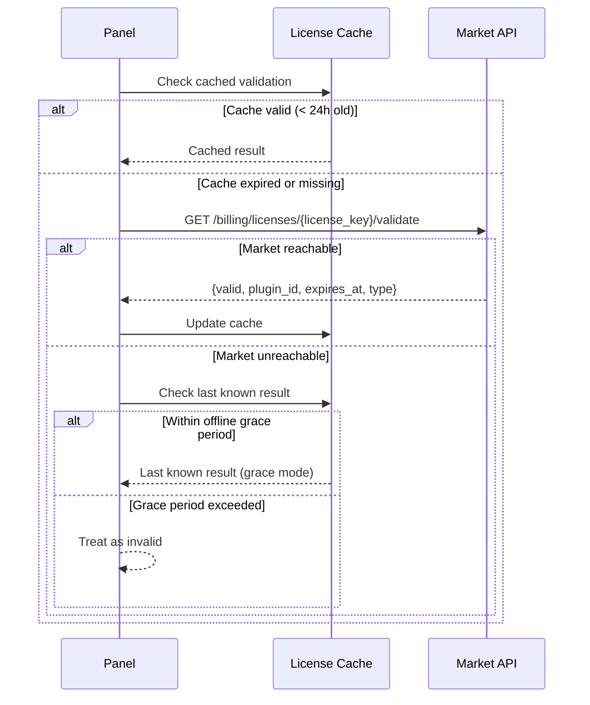
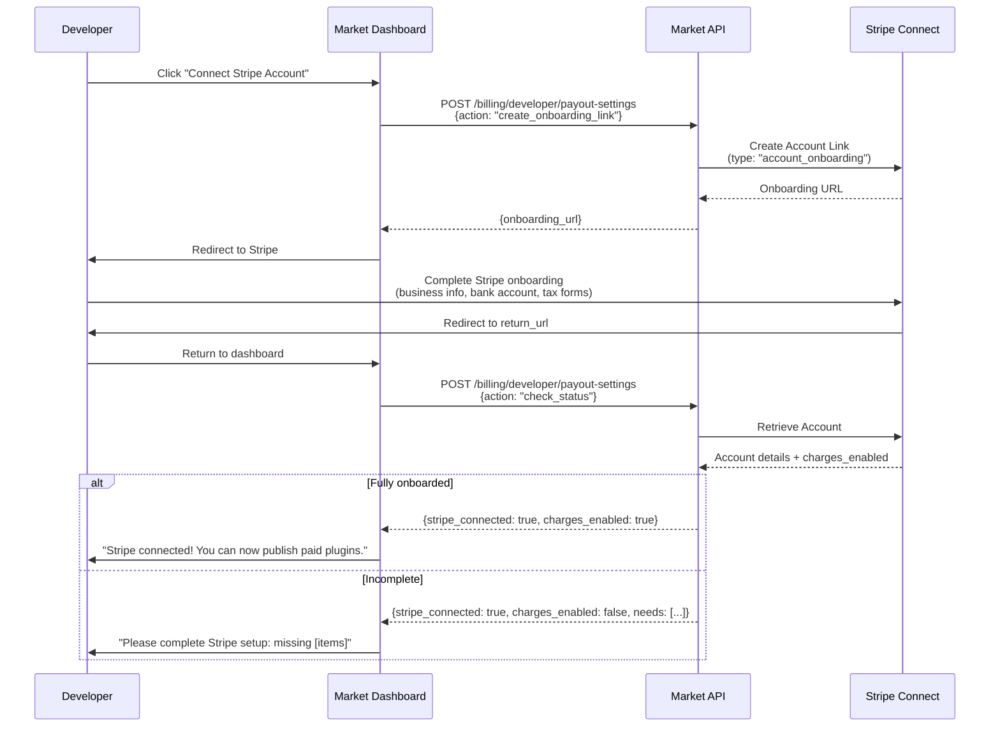
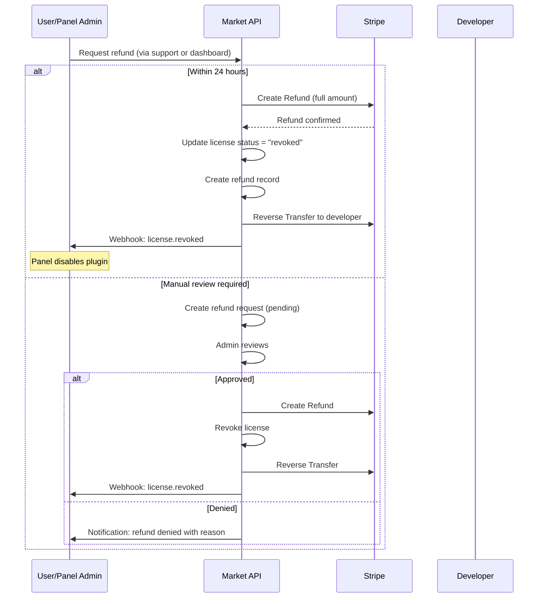
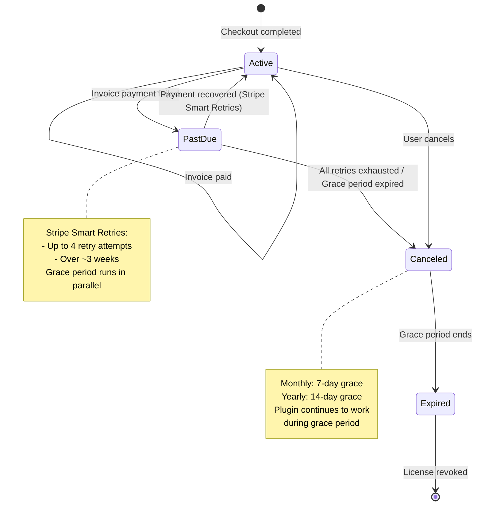

# ACP Market - Billing & Licensing System

> **PROPRIETARY & CONFIDENTIAL** - Internal design document for ACP Market development.

## Overview

ACP Market uses Stripe as the payment processor for all billing operations. Plugin developers receive payouts through Stripe Connect. Panel instances purchase licenses via Stripe Checkout and validate them against the Market API.

---

## Pricing Models

| Model | Stripe Object | License Duration | Renewal | Grace Period |
|-------|--------------|-----------------|---------|--------------|
| `free` | None | Indefinite | N/A | N/A |
| `one_time` | Payment Intent (via Checkout) | Current major version (e.g., v1.x) | New purchase required for next major (v2.0+) | N/A |
| `subscription_monthly` | Subscription | Until cancelled or payment failure | Auto-renew monthly | 7 days after expiry |
| `subscription_yearly` | Subscription | Until cancelled or payment failure | Auto-renew yearly | 14 days after expiry |

### Pricing Configuration per Plugin

Developers set pricing when submitting a plugin:

```json
{
  "pricing": {
    "model": "one_time",
    "price": 9.99,
    "currency": "USD"
  }
}
```

| Field | Type | Constraints |
|-------|------|-------------|
| `model` | string | `free`, `one_time`, `subscription_monthly`, `subscription_yearly` |
| `price` | number | Min $0.99, max $999.99. Not applicable for `free`. |
| `currency` | string | `USD` only (initial launch). Multi-currency planned for future. |

### Price Change Policy

- Price changes only affect **new** purchases.
- Existing licenses/subscriptions retain their original price.
- For subscriptions, the new price applies at the next renewal after the change is made.
- Developers must acknowledge this before changing price.

---

## Checkout Flow

### Sequence Diagram



### Checkout Session Configuration

```python
# Market backend - Stripe Checkout Session creation

checkout_session = stripe.checkout.Session.create(
    mode="payment" if pricing_model == "one_time" else "subscription",
    customer=stripe_customer_id,
    line_items=[{
        "price_data": {
            "currency": "usd",
            "product_data": {
                "name": plugin.name,
                "description": f"ACP Market Plugin: {plugin.short_description}",
                "metadata": {
                    "plugin_id": plugin.id,
                    "version": version,
                }
            },
            "unit_amount": int(plugin.price * 100),  # cents
            "recurring": {"interval": "month"} if pricing_model == "subscription_monthly"
                    else {"interval": "year"} if pricing_model == "subscription_yearly"
                    else None,
        },
        "quantity": 1,
    }],
    payment_intent_data={
        "application_fee_amount": int(plugin.price * 100 * platform_fee_rate),
        "transfer_data": {
            "destination": developer.stripe_account_id,
        },
    } if pricing_model == "one_time" else None,
    subscription_data={
        "application_fee_percent": platform_fee_rate * 100,
        "transfer_data": {
            "destination": developer.stripe_account_id,
        },
    } if pricing_model.startswith("subscription") else None,
    metadata={
        "plugin_id": plugin.id,
        "version": version,
        "panel_instance_id": api_key.panel_instance_id,
        "market_user_id": user.id,
    },
    success_url=return_url + "?session_id={CHECKOUT_SESSION_ID}&status=success",
    cancel_url=cancel_url or return_url + "?status=cancelled",
    expires_after=1800,  # 30 minutes
)
```

---

## License Key System

### Key Format

```
acp_lic_{plugin_slug}_{32_hex_chars}
```

**Examples**:
```
acp_lic_movie-request_a1b2c3d4e5f6a7b8c9d0e1f2a3b4c5d6
acp_lic_auto-responder_f1e2d3c4b5a6f7e8d9c0b1a2f3e4d5c6
```

### Key Generation

```python
import secrets

def generate_license_key(plugin_slug: str) -> str:
    random_hex = secrets.token_hex(16)  # 32 hex chars
    return f"acp_lic_{plugin_slug}_{random_hex}"
```

### Key Storage

- **Market side**: License keys stored hashed (SHA-256) in the database. Only the key prefix is stored in plaintext for lookup.
- **Panel side**: License keys stored in the `installed_plugins` table, encrypted at rest using the Panel's `SECRET_KEY`.

---

## License Validation

### When Panel Validates

| Trigger | Behavior on Failure |
|---------|-------------------|
| Plugin activation (startup) | Disable plugin, show warning in admin panel |
| Daily health check (background task) | Log warning, apply grace period rules |
| Plugin update | Block update, show "license expired" message |
| Manual check (admin clicks "Verify License") | Show current status in UI |

### Validation Request Flow



### Validation API Response

```json
{
  "valid": true,
  "license_key_prefix": "acp_lic_movie-request_a1b2c3d4...",
  "plugin_id": "plg_movie-request",
  "type": "one_time",
  "status": "active",
  "valid_for_version": "1.x",
  "expires_at": null,
  "grace_period_active": false,
  "validated_at": "2026-03-24T12:00:00Z"
}
```

### Offline Grace Periods

When the Market API is unreachable, the Panel uses cached validation results:

| License Type | Offline Grace Period | Behavior After Grace |
|-------------|---------------------|---------------------|
| `one_time` | 30 days from last successful validation | Disable plugin |
| `subscription_monthly` | 7 days after cached `expires_at` | Disable plugin |
| `subscription_yearly` | 14 days after cached `expires_at` | Disable plugin |

### One-Time License Version Rules

One-time licenses are valid for the **current major version** at time of purchase:

| Purchased Version | License Valid For | Requires New Purchase |
|-------------------|------------------|----------------------|
| 1.0.0 | 1.x (1.0.0, 1.1.0, 1.2.3, etc.) | 2.0.0+ |
| 2.0.0 | 2.x (2.0.0, 2.1.0, etc.) | 3.0.0+ |

When a major version is released:
1. Existing users see "Upgrade available (new purchase required)" in Panel
2. The old major version remains downloadable with existing license
3. Developer can optionally offer an upgrade discount

---

## Revenue Split

### Fee Structure

| Component | Percentage | Recipient |
|-----------|-----------|-----------|
| Platform fee | 30% (configurable) | ACP Market |
| Developer payout | 70% (configurable) | Plugin developer |

The platform fee is configurable per-plugin or globally. Default is 30%.

### Payout Mechanics

- Payouts are processed automatically via Stripe Connect.
- For `one_time` purchases: Transfer created immediately after checkout completion.
- For `subscription` purchases: Transfer created on each successful invoice payment.
- Minimum payout threshold: $10.00.
  - Below threshold: Earnings accumulate until threshold is met.
  - Stripe Connect handles the actual payout schedule to the developer's bank.

### Revenue Tracking

```json
{
  "purchase": {
    "gross_amount": 9.99,
    "stripe_fee": 0.59,
    "platform_fee": 2.82,
    "developer_payout": 6.58,
    "currency": "USD"
  }
}
```

> Note: Stripe processing fees (~2.9% + $0.30) are deducted from the gross amount before the platform/developer split.

Actual split formula:
```
net_amount = gross_amount - stripe_processing_fee
platform_take = net_amount * platform_fee_rate
developer_payout = net_amount - platform_take
```

---

## Stripe Connect for Developers

### Onboarding Flow



### Stripe Connect Account Type

- **Account type**: Express (Stripe manages the dashboard and payouts)
- **Business type**: Individual or Company (developer's choice during onboarding)
- **Capabilities**: `card_payments`, `transfers`

### Developer Dashboard Access

Developers can access their Stripe Express dashboard to:
- View payout history
- Update bank account details
- Download tax documents (1099 for US developers)

```
POST /billing/developer/payout-settings
{ "action": "create_dashboard_link" }

Response: { "dashboard_url": "https://connect.stripe.com/express/..." }
```

---

## Refund Policy

### Automatic Refund Window

| Time Since Purchase | Refund Policy | Action |
|--------------------|--------------|---------|
| 0-24 hours | Full refund | Automatic on request |
| 24 hours - 7 days | Partial refund (case by case) | Admin manual review |
| 7+ days | No refund | Appeal to support only |

### Refund Flow



### Refund Impact on Developer

- Refunded amount (minus Stripe fees) is deducted from developer's next payout.
- If developer balance is negative, future earnings are held until balance is positive.
- Excessive refund rates (>10%) trigger admin review of the plugin.

---

## Subscription Lifecycle

### State Machine



### Subscription Events Handling

| Stripe Event | Market Action |
|--------------|--------------|
| `checkout.session.completed` (subscription) | Create license (status: `active`), start subscription |
| `invoice.payment_succeeded` | Update license `expires_at`, log payment |
| `invoice.payment_failed` | Set license to `past_due`, notify Panel via webhook |
| `customer.subscription.updated` | Update license metadata (plan changes) |
| `customer.subscription.deleted` | Set license to `canceled`, start grace period countdown |
| `charge.refunded` | Revoke license, reverse developer transfer |

### Grace Period Behavior

During the grace period:
1. Plugin continues to function on the Panel.
2. Panel shows warning: "Subscription expired. Plugin will be disabled on {date}."
3. Market API returns `grace_period_active: true` in license validation.
4. If payment is recovered, grace period is canceled and license returns to `active`.

After grace period expires:
1. License status set to `expired`.
2. `license.expired` webhook sent to Panel.
3. Panel disables the plugin.
4. Plugin data is preserved (not deleted) for potential reactivation.

---

## Database Schema

### licenses

```sql
CREATE TABLE licenses (
    id              VARCHAR(32) PRIMARY KEY,            -- e.g., "lic_m1n2o3"
    license_key_hash VARCHAR(64) NOT NULL UNIQUE,       -- SHA-256 hash of license key
    license_key_prefix VARCHAR(48) NOT NULL,            -- First 48 chars for display
    plugin_id       VARCHAR(64) NOT NULL REFERENCES plugins(id),
    user_id         VARCHAR(32) NOT NULL REFERENCES users(id),
    type            VARCHAR(32) NOT NULL,               -- free, one_time, subscription_monthly, subscription_yearly
    status          VARCHAR(32) NOT NULL DEFAULT 'active', -- active, past_due, canceled, expired, revoked
    valid_for_major INTEGER,                            -- Major version number (e.g., 1 for v1.x). NULL for subscriptions.
    stripe_customer_id VARCHAR(64),
    stripe_subscription_id VARCHAR(64),                 -- NULL for one_time
    stripe_session_id VARCHAR(128),                     -- Original checkout session
    purchased_at    TIMESTAMP WITH TIME ZONE NOT NULL DEFAULT NOW(),
    expires_at      TIMESTAMP WITH TIME ZONE,           -- NULL for one_time (version-based)
    grace_ends_at   TIMESTAMP WITH TIME ZONE,           -- NULL unless in grace period
    revoked_at      TIMESTAMP WITH TIME ZONE,
    revoke_reason   TEXT,
    created_at      TIMESTAMP WITH TIME ZONE NOT NULL DEFAULT NOW(),
    updated_at      TIMESTAMP WITH TIME ZONE NOT NULL DEFAULT NOW()
);

CREATE INDEX idx_licenses_user ON licenses(user_id);
CREATE INDEX idx_licenses_plugin ON licenses(plugin_id);
CREATE INDEX idx_licenses_status ON licenses(status);
CREATE INDEX idx_licenses_stripe_sub ON licenses(stripe_subscription_id);
```

### purchases

```sql
CREATE TABLE purchases (
    id                  VARCHAR(32) PRIMARY KEY,
    user_id             VARCHAR(32) NOT NULL REFERENCES users(id),
    plugin_id           VARCHAR(64) NOT NULL REFERENCES plugins(id),
    license_id          VARCHAR(32) NOT NULL REFERENCES licenses(id),
    gross_amount        DECIMAL(10, 2) NOT NULL,        -- Total charged
    stripe_fee          DECIMAL(10, 2) NOT NULL,        -- Stripe processing fee
    platform_fee        DECIMAL(10, 2) NOT NULL,        -- Platform take
    developer_payout    DECIMAL(10, 2) NOT NULL,        -- Amount to developer
    currency            VARCHAR(3) NOT NULL DEFAULT 'USD',
    stripe_payment_intent VARCHAR(128),
    stripe_invoice_id   VARCHAR(128),                   -- For subscription payments
    refunded            BOOLEAN NOT NULL DEFAULT FALSE,
    refunded_at         TIMESTAMP WITH TIME ZONE,
    refund_amount       DECIMAL(10, 2),
    created_at          TIMESTAMP WITH TIME ZONE NOT NULL DEFAULT NOW()
);

CREATE INDEX idx_purchases_user ON purchases(user_id);
CREATE INDEX idx_purchases_plugin ON purchases(plugin_id);
CREATE INDEX idx_purchases_created ON purchases(created_at);
```

### developer_payouts

```sql
CREATE TABLE developer_payouts (
    id                  VARCHAR(32) PRIMARY KEY,
    developer_id        VARCHAR(32) NOT NULL REFERENCES users(id),
    amount              DECIMAL(10, 2) NOT NULL,
    currency            VARCHAR(3) NOT NULL DEFAULT 'USD',
    stripe_transfer_id  VARCHAR(128) NOT NULL,
    stripe_account_id   VARCHAR(64) NOT NULL,
    status              VARCHAR(32) NOT NULL DEFAULT 'pending', -- pending, paid, failed, reversed
    plugin_id           VARCHAR(64) REFERENCES plugins(id),     -- NULL if aggregated payout
    purchase_id         VARCHAR(32) REFERENCES purchases(id),
    failed_reason       TEXT,
    created_at          TIMESTAMP WITH TIME ZONE NOT NULL DEFAULT NOW(),
    completed_at        TIMESTAMP WITH TIME ZONE
);

CREATE INDEX idx_payouts_developer ON developer_payouts(developer_id);
CREATE INDEX idx_payouts_status ON developer_payouts(status);
```

### subscription_events

```sql
CREATE TABLE subscription_events (
    id                  VARCHAR(32) PRIMARY KEY,
    license_id          VARCHAR(32) NOT NULL REFERENCES licenses(id),
    event_type          VARCHAR(64) NOT NULL,           -- payment_succeeded, payment_failed, canceled, renewed, grace_started, grace_expired
    stripe_event_id     VARCHAR(128) UNIQUE,
    details             JSONB,                          -- Additional event data
    created_at          TIMESTAMP WITH TIME ZONE NOT NULL DEFAULT NOW()
);

CREATE INDEX idx_sub_events_license ON subscription_events(license_id);
CREATE INDEX idx_sub_events_type ON subscription_events(event_type);
CREATE INDEX idx_sub_events_stripe ON subscription_events(stripe_event_id);
```

### stripe_customers

```sql
CREATE TABLE stripe_customers (
    id                  VARCHAR(32) PRIMARY KEY,
    user_id             VARCHAR(32) NOT NULL UNIQUE REFERENCES users(id),
    stripe_customer_id  VARCHAR(64) NOT NULL UNIQUE,
    stripe_account_id   VARCHAR(64),                    -- Stripe Connect account (for developers)
    connect_onboarded   BOOLEAN NOT NULL DEFAULT FALSE,
    charges_enabled     BOOLEAN NOT NULL DEFAULT FALSE,
    created_at          TIMESTAMP WITH TIME ZONE NOT NULL DEFAULT NOW(),
    updated_at          TIMESTAMP WITH TIME ZONE NOT NULL DEFAULT NOW()
);

CREATE INDEX idx_stripe_customers_user ON stripe_customers(user_id);
CREATE INDEX idx_stripe_customers_stripe ON stripe_customers(stripe_customer_id);
```

---

## Webhook Processing

### Stripe Webhook Endpoint Security

```python
@router.post("/billing/webhooks/stripe")
async def stripe_webhook(request: Request):
    payload = await request.body()
    sig_header = request.headers.get("Stripe-Signature")

    try:
        event = stripe.Webhook.construct_event(
            payload, sig_header, settings.STRIPE_WEBHOOK_SECRET
        )
    except stripe.error.SignatureVerificationError:
        raise HTTPException(status_code=400, detail="Invalid signature")

    # Process event idempotently (check stripe_event_id not already processed)
    await process_stripe_event(event)

    return {"received": True}
```

### Idempotency

All webhook handlers are idempotent:
1. Check if `stripe_event_id` exists in `subscription_events` table.
2. If exists, return success without processing.
3. If not, process and record the event atomically.

This handles Stripe's retry behavior (Stripe may send the same event multiple times).

---

## Tax Handling

- **Phase 1 (launch)**: No tax calculation. Prices are exclusive of tax. Users are responsible for their local tax obligations.
- **Phase 2 (future)**: Integrate Stripe Tax for automatic tax calculation and collection based on buyer location.

### Developer Tax Reporting

- US developers: Stripe issues 1099-K forms (if threshold met).
- International developers: Stripe provides payout summaries for local tax reporting.
- Market does not withhold taxes (Stripe Connect handles this where required).

---

## Currency & Pricing Constraints

| Constraint | Value |
|------------|-------|
| Supported currencies | USD (launch), EUR/GBP planned |
| Minimum price | $0.99 |
| Maximum price | $999.99 |
| Price precision | 2 decimal places |
| Free tier | $0.00 (model: `free`) |
