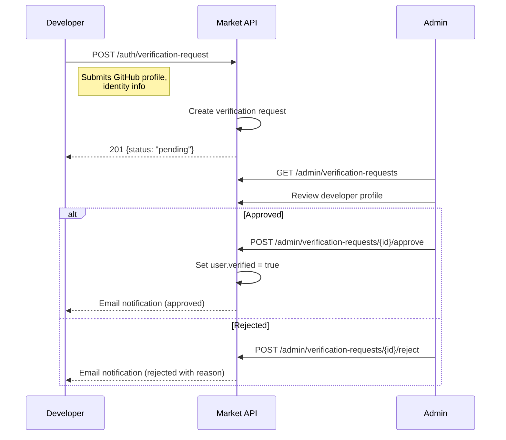

# ACP Market - Role-Based Access Control (RBAC)

> **PROPRIETARY & CONFIDENTIAL** - Internal design document for ACP Market development.

## Overview

ACP Market uses a hierarchical role system combined with API key scopes to control access. Every user has exactly one role. API keys carry a set of scopes that restrict what operations the Panel instance can perform.

---

## Role Hierarchy

```
super_admin          Full platform control. Database-seeded only.
  |
  +-- admin          Manage content, users, platform settings
       |
       +-- reviewer  Review and approve/reject plugin submissions
            |
            +-- developer   Submit plugins, manage own plugins, view earnings
                 |
                 +-- user    Browse, install, purchase plugins
```

Each role inherits all permissions of the roles below it. A `reviewer` can do everything a `developer` and `user` can do.

---

## Role Assignment Rules

| Target Role | Assigned By | Method |
|-------------|-------------|--------|
| `user` | System | Manual downgrade by admin only |
| `developer` | System | Default on registration |
| `reviewer` | `admin` or `super_admin` | PATCH /admin/users/{id} |
| `admin` | `super_admin` | PATCH /admin/users/{id} |
| `super_admin` | N/A | Database seed only (not assignable via API) |

- New accounts are created with the `developer` role, which includes all `user` capabilities.
- An admin cannot promote someone to `admin` -- only `super_admin` can.
- `super_admin` accounts cannot be modified or demoted via API.

---

## Permission Matrix

### Authentication Endpoints

| Endpoint | Method | user | developer | reviewer | admin | super_admin |
|----------|--------|------|-----------|----------|-------|-------------|
| /auth/register | POST | - | - | - | - | - |
| /auth/login | POST | - | - | - | - | - |
| /auth/refresh | POST | - | - | - | - | - |
| /auth/api-keys | POST | - | - | - | - | - |
| /auth/api-keys | GET | - | - | - | - | - |
| /auth/api-keys/{id} | DELETE | - | - | - | - | - |
| /auth/me | GET | - | - | - | - | - |

> Authentication endpoints are either public (register/login) or require any valid JWT (api-keys, me). See note below.

**Auth endpoints access**:

| Endpoint | Method | Public | Any JWT | Any API Key |
|----------|--------|--------|---------|-------------|
| /auth/register | POST | Yes | - | - |
| /auth/login | POST | Yes | - | - |
| /auth/refresh | POST | Yes (refresh token in body) | - | - |
| /auth/api-keys | POST | - | Yes | - |
| /auth/api-keys | GET | - | Yes | - |
| /auth/api-keys/{id} | DELETE | - | Yes | - |
| /auth/me | GET | - | Yes | Yes |

### Plugin Registry Endpoints

| Endpoint | Method | Public | user | developer | reviewer | admin | super_admin |
|----------|--------|--------|------|-----------|----------|-------|-------------|
| /plugins | GET | Yes | Yes | Yes | Yes | Yes | Yes |
| /plugins/{id} | GET | Yes | Yes | Yes | Yes | Yes | Yes |
| /plugins/{id}/versions | GET | Yes | Yes | Yes | Yes | Yes | Yes |
| /plugins/{id}/versions/{ver} | GET | Yes | Yes | Yes | Yes | Yes | Yes |
| /plugins | POST | - | - | Yes (own) | Yes (own) | Yes | Yes |
| /plugins/{id}/versions | POST | - | - | Yes (own) | Yes (own) | Yes | Yes |
| /plugins/{id} | PATCH | - | - | Yes (own) | Yes (own) | Yes | Yes |
| /plugins/{id} | DELETE | - | - | - | - | Yes | Yes |

> "Yes (own)" means the developer/reviewer can only perform this action on plugins they own.

### Plugin Download Endpoints

| Endpoint | Method | API Key Scope Required | user | developer | reviewer | admin | super_admin |
|----------|--------|----------------------|------|-----------|----------|-------|-------------|
| /plugins/{id}/versions/{ver}/download | GET | `registry:read` | Yes | Yes | Yes | Yes | Yes |
| /plugins/{id}/versions/{ver}/signature | GET | `registry:read` | Yes | Yes | Yes | Yes | Yes |
| /plugins/check-updates | POST | `registry:read` | Yes | Yes | Yes | Yes | Yes |

> Download endpoints use API Key auth. The role of the API key owner determines access. Paid plugins additionally require a valid license.

### Review Endpoints

| Endpoint | Method | user | developer | reviewer | admin | super_admin |
|----------|--------|------|-----------|----------|-------|-------------|
| /review/queue | GET | - | - | Yes | Yes | Yes |
| /review/{submission_id} | GET | - | - | Yes | Yes | Yes |
| /review/{submission_id}/approve | POST | - | - | Yes | Yes | Yes |
| /review/{submission_id}/reject | POST | - | - | Yes | Yes | Yes |
| /review/{submission_id}/request-changes | POST | - | - | Yes | Yes | Yes |

### Billing Endpoints

| Endpoint | Method | API Key Scope | user | developer | reviewer | admin | super_admin |
|----------|--------|--------------|------|-----------|----------|-------|-------------|
| /billing/checkout | POST | `billing:write` | Yes | Yes | Yes | Yes | Yes |
| /billing/licenses | GET | `billing:read` | Yes | Yes | Yes | Yes | Yes |
| /billing/licenses/{id} | GET | `billing:read` | Yes | Yes | Yes | Yes | Yes |
| /billing/webhooks/stripe | POST | Stripe signature | - | - | - | - | - |
| /billing/developer/earnings | GET | - (JWT only) | - | Yes | Yes | Yes | Yes |
| /billing/developer/payout-settings | POST | - (JWT only) | - | Yes | Yes | Yes | Yes |

### Analytics Endpoints

| Endpoint | Method | user | developer | reviewer | admin | super_admin |
|----------|--------|------|-----------|----------|-------|-------------|
| /analytics/plugin/{id} | GET | - | Yes (own) | - | Yes | Yes |
| /analytics/global | GET | - | - | - | Yes | Yes |

### Admin Endpoints

| Endpoint | Method | user | developer | reviewer | admin | super_admin |
|----------|--------|------|-----------|----------|-------|-------------|
| /admin/users | GET | - | - | - | Yes | Yes |
| /admin/users/{id} | PATCH | - | - | - | Yes* | Yes |
| /admin/stats | GET | - | - | - | Yes | Yes |

> *Admin can assign roles up to `reviewer`. Only `super_admin` can assign `admin` role.

---

## API Key Scopes

Panel instances authenticate using API keys with granular scopes. Scopes determine which endpoints the key can access.

### Available Scopes

| Scope | Description | Endpoints Accessible |
|-------|-------------|---------------------|
| `registry:read` | Browse, search, download plugins | GET /plugins/*, GET /plugins/{id}/versions/{ver}/download, GET /plugins/{id}/versions/{ver}/signature, POST /plugins/check-updates |
| `registry:write` | Submit new plugins and versions | POST /plugins, POST /plugins/{id}/versions, PATCH /plugins/{id} |
| `billing:read` | Check license validity | GET /billing/licenses, GET /billing/licenses/{id} |
| `billing:write` | Create checkout sessions | POST /billing/checkout |

### Scope Combinations

| Use Case | Recommended Scopes |
|----------|-------------------|
| Production Panel (install only) | `registry:read`, `billing:read`, `billing:write` |
| Development Panel (publish + install) | `registry:read`, `registry:write`, `billing:read`, `billing:write` |
| CI/CD pipeline (publish only) | `registry:write` |
| License validation service | `billing:read` |

### Scope Validation Rules

1. An API key can only have scopes that the key owner's role permits:
   - `user` role: `registry:read`, `billing:read`, `billing:write`
   - `developer`+ role: All scopes
2. If a user's role is downgraded, existing API keys with now-unauthorized scopes are automatically deactivated.
3. Expired API keys return `401 UNAUTHORIZED` with error code `API_KEY_EXPIRED`.

---

## Developer Verification

Optional verification process that grants a "Verified" badge and unlocks paid plugin publishing.

### Verification Flow



### Verification Requirements

| Requirement | Details |
|-------------|---------|
| GitHub profile | Public profile with activity history |
| Valid email | Verified email address |
| Identity | Real name or organization name |
| Reason for publishing | Brief description of intended plugins |

### Verification Implications

| Capability | Unverified Developer | Verified Developer |
|------------|---------------------|-------------------|
| Submit free plugins | Yes | Yes |
| Submit paid plugins | No | Yes |
| Maximum bundle size | 10MB | 50MB |
| Priority review | No | Yes |
| Verified badge on plugins | No | Yes |
| Maximum plugins | 5 | Unlimited |

---

## Data Access Rules

### Developer Data Isolation

Developers operate in a strict data silo:

| Data Type | Own Resources | Other Developers' Resources |
|-----------|---------------|---------------------------|
| Plugin metadata | Read/Write | Read (published only) |
| Plugin versions | Read/Write | Read (published only) |
| Plugin analytics | Read | No access |
| Plugin submissions | Read/Write | No access |
| Earnings data | Read | No access |
| License data | N/A (licenses belong to purchasers) | N/A |

### Reviewer Access Boundaries

| Data Type | Access Level |
|-----------|-------------|
| Pending submissions | Full read (code, manifest, metadata) |
| Published plugins | Read only (public data) |
| Developer profiles | Read only (relevant to review) |
| Plugin analytics | No access |
| User management | No access |
| Billing data | No access |

### Admin Access

Admins have read/write access to everything except:
- Cannot modify `super_admin` accounts
- Cannot assign `super_admin` role
- Cannot view raw API key values (only prefixes)
- Cannot view user passwords (hashed, no raw access)

### API Key Data Access

Panel instances (via API key) can only access:
- Published plugin data (browse, search, download)
- Their own licenses (purchase, validate)
- Update checks for their installed plugins
- No access to other users' data, analytics, or admin functions

---

## Session and Token Security

### JWT Token Claims

```json
{
  "sub": "usr_a1b2c3d4",
  "role": "developer",
  "verified": true,
  "iat": 1711281600,
  "exp": 1711282500,
  "jti": "tok_unique_id"
}
```

### Token Lifecycle

| Token Type | Lifetime | Revocation |
|------------|----------|------------|
| Access token (JWT) | 15 minutes | Short-lived, not revocable |
| Refresh token | 30 days | Revocable (stored in DB) |
| API Key | Configurable (or never) | Revocable via DELETE endpoint |

### Security Controls

1. **Role change propagation**: When a user's role changes, all active refresh tokens are revoked, forcing re-authentication.
2. **Suspension enforcement**: Suspended accounts have all refresh tokens and API keys immediately deactivated.
3. **API key rotation**: Users are encouraged to rotate API keys. The system tracks `last_used_at` to identify stale keys.
4. **IP allowlisting** (optional): API keys can be restricted to specific IP addresses or CIDR ranges.
5. **Audit logging**: All role changes, suspensions, and admin actions are logged with actor, target, action, and timestamp.

---

## Audit Trail

All permission-sensitive operations generate audit log entries:

```json
{
  "id": "aud_x1y2z3",
  "actor_id": "usr_admin01",
  "actor_role": "admin",
  "action": "user.role_changed",
  "target_type": "user",
  "target_id": "usr_a1b2c3d4",
  "details": {
    "old_role": "developer",
    "new_role": "reviewer"
  },
  "ip_address": "203.0.113.42",
  "timestamp": "2026-03-24T12:00:00Z"
}
```

### Audited Actions

| Action | Description |
|--------|-------------|
| `user.role_changed` | User role modified |
| `user.suspended` | User account suspended |
| `user.unsuspended` | User account reactivated |
| `user.verified` | Developer verification granted |
| `api_key.created` | New API key generated |
| `api_key.revoked` | API key deleted |
| `plugin.recalled` | Plugin force-removed |
| `plugin.deleted` | Plugin deleted by admin |
| `review.approved` | Submission approved |
| `review.rejected` | Submission rejected |
| `license.revoked` | License manually revoked |
