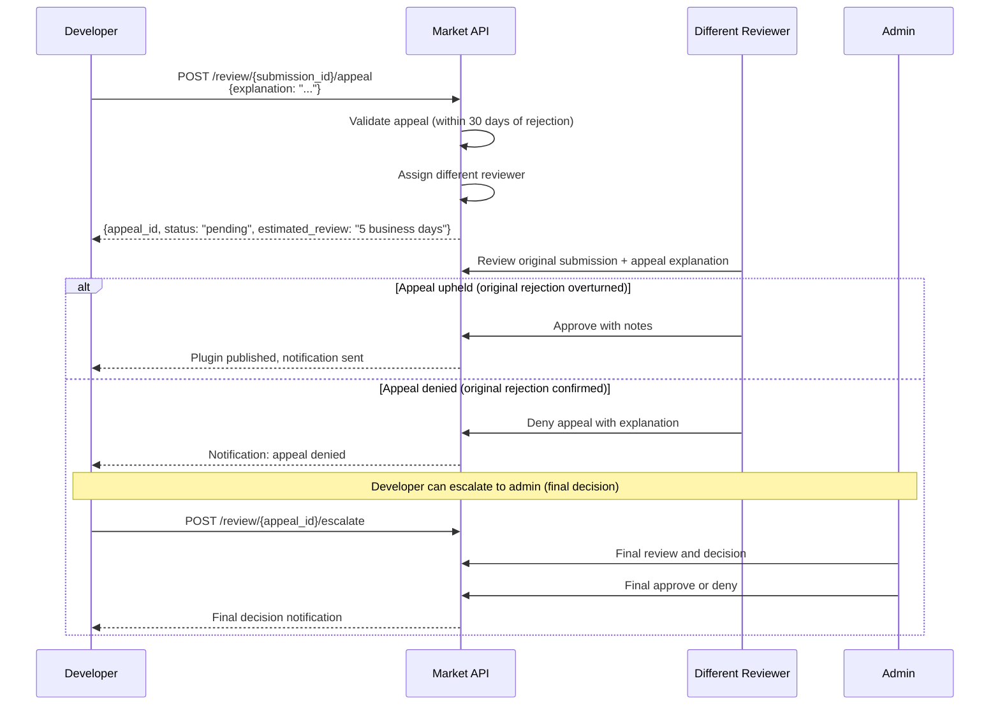
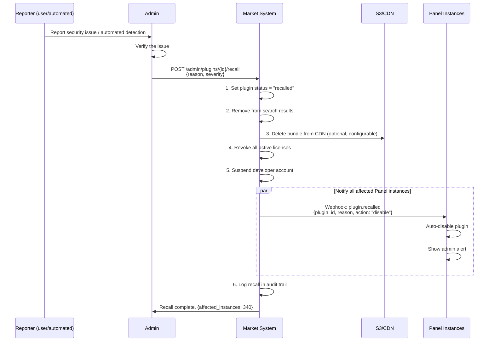

# ACP Market - Plugin Review Guide

> **PROPRIETARY & CONFIDENTIAL** - Internal design document for ACP Market development.

## Overview

Every plugin submission goes through a two-phase review process: automated checks (Phase 1) followed by human review (Phase 2). This document defines the complete review pipeline, reviewer checklists, and governance processes.

---

## Submission Requirements

Before a plugin can be submitted, the developer must provide:

| Requirement | Details | Validated By |
|-------------|---------|-------------|
| `manifest.json` | Valid plugin manifest at bundle root | Automated |
| `README.md` | Usage instructions, min 100 characters | Automated |
| At least 1 screenshot | PNG or JPG, min 800x600 | Automated |
| `CHANGELOG.md` | Version history (required for updates, optional for initial) | Automated |
| All declared files present | Every file referenced in manifest must exist in bundle | Automated |
| Bundle size | Maximum 50MB (10MB for unverified developers) | Automated |
| Icon | PNG or SVG, min 256x256 (submitted separately) | Automated |

### manifest.json Schema

```json
{
  "id": "movie-request",
  "name": "Movie Request Bot",
  "version": "1.2.0",
  "author": "sakakibara",
  "short_description": "Allow users to request movies via Telegram",
  "min_panel_version": "0.7.0",
  "max_panel_version": null,
  "capabilities": ["bot_handler", "web_panel", "settings_page", "database"],
  "entry_points": {
    "backend": "backend/main.py",
    "frontend": "frontend/index.tsx"
  },
  "routes": {
    "prefix": "/plugins/movie-request",
    "api_prefix": "/api/v1/plugins/movie-request"
  },
  "database": {
    "table_prefix": "plg_movie_request_",
    "migrations_dir": "backend/migrations"
  },
  "dependencies": {
    "python": ["httpx>=0.24.0", "pydantic>=2.0.0"],
    "npm": ["@tanstack/react-query", "lucide-react"]
  },
  "settings_schema": {
    "type": "object",
    "properties": {
      "tmdb_api_key": {
        "type": "string",
        "title": "TMDB API Key",
        "description": "API key for The Movie Database"
      }
    },
    "required": ["tmdb_api_key"]
  },
  "license": "MIT"
}
```

---

## Phase 1: Automated Review

Automated review runs immediately upon submission. Results are available within 5 minutes.

### Automated Check Details

#### 1. Manifest Schema Validation

| Check | Action on Fail |
|-------|---------------|
| `manifest.json` exists at bundle root | **Reject** |
| All required fields present (`id`, `name`, `version`, `author`, `short_description`, `min_panel_version`, `capabilities`, `entry_points`) | **Reject** |
| `id` matches pattern `[a-z0-9]([a-z0-9-]*[a-z0-9])?` (3-64 chars) | **Reject** |
| `version` is valid semver | **Reject** |
| `min_panel_version` is valid semver | **Reject** |
| `capabilities` contains only valid values | **Reject** |
| `entry_points` reference files that exist in the bundle | **Reject** |

Valid capabilities: `bot_handler`, `web_panel`, `settings_page`, `database`, `cron_job`, `webhook_handler`, `api_extension`

#### 2. Bundle Size Check

```python
MAX_BUNDLE_SIZE_VERIFIED = 50 * 1024 * 1024    # 50 MB
MAX_BUNDLE_SIZE_UNVERIFIED = 10 * 1024 * 1024  # 10 MB

if bundle_size > max_size:
    reject("Bundle size exceeds maximum allowed size")
```

**Action on fail**: **Reject**

#### 3. Python Syntax Check

Run `py_compile` on all `.py` files in the bundle:

```python
import py_compile

for py_file in bundle.glob("**/*.py"):
    try:
        py_compile.compile(py_file, doraise=True)
    except py_compile.PyCompileError as e:
        reject(f"Python syntax error in {py_file}: {e}")
```

**Action on fail**: **Reject**

#### 4. TypeScript Build Check

If `entry_points.frontend` is declared:

```bash
cd bundle/frontend
npx tsc --noEmit --strict 2>&1
```

**Action on fail**: **Reject**

#### 5. Python Dependency Vulnerability Scan

```bash
pip-audit -r bundle/requirements.txt --format=json 2>&1
# or
safety check -r bundle/requirements.txt --json 2>&1
```

| Severity | Action |
|----------|--------|
| Critical / High | **Reject** |
| Medium | **Warn** (reviewer attention) |
| Low | **Warn** (informational) |

**Action on fail**: **Warn** (unless critical/high severity)

#### 6. npm Dependency Vulnerability Scan

If `package.json` exists:

```bash
cd bundle/frontend
npm audit --json 2>&1
```

| Severity | Action |
|----------|--------|
| Critical / High | **Reject** |
| Medium | **Warn** |
| Low | **Warn** |

**Action on fail**: **Warn** (unless critical/high severity)

#### 7. Forbidden Pattern Scan

Scan all Python files for dangerous patterns:

| Pattern | Regex | Reason | Action |
|---------|-------|--------|--------|
| `eval()` | `\beval\s*\(` | Arbitrary code execution | **Reject** |
| `exec()` | `\bexec\s*\(` | Arbitrary code execution | **Reject** |
| `__import__()` | `__import__\s*\(` | Dynamic module import | **Reject** |
| `subprocess` | `\bsubprocess\b` | Shell command execution | **Reject** |
| `os.system` | `\bos\.system\s*\(` | Shell command execution | **Reject** |
| `os.popen` | `\bos\.popen\s*\(` | Shell command execution | **Reject** |
| `shutil.rmtree` | `\bshutil\.rmtree\s*\(` | Filesystem destruction | **Reject** |
| `open(` on system paths | `open\s*\(\s*['"]/(?:etc|var|usr)` | System file access | **Reject** |
| `socket.socket` | `\bsocket\.socket\s*\(` | Raw socket creation | **Reject** |
| `ctypes` | `\bimport\s+ctypes\b` | C library access | **Reject** |

Scan all TypeScript/JavaScript files:

| Pattern | Regex | Reason | Action |
|---------|-------|--------|--------|
| `eval()` | `\beval\s*\(` | Arbitrary code execution | **Reject** |
| `Function()` constructor | `\bnew\s+Function\s*\(` | Dynamic code creation | **Reject** |
| `dangerouslySetInnerHTML` | `dangerouslySetInnerHTML` | XSS risk | **Warn** |
| `document.write` | `\bdocument\.write\s*\(` | DOM injection | **Reject** |

#### 8. Core Model Import Check

Plugins must not import directly from the ADMINCHAT Panel core:

```python
FORBIDDEN_IMPORTS = [
    r"from\s+app\.models\b",
    r"from\s+app\.core\b",
    r"from\s+app\.api\b",
    r"from\s+app\.services\b",
    r"import\s+app\.",
]
```

Plugins should use the Plugin SDK (`from acp_sdk import ...`) instead.

**Action on fail**: **Reject**

#### 9. Table Name Prefix Check

If the plugin declares `database` capability, all SQL table creation statements must use the declared prefix:

```python
expected_prefix = f"plg_{manifest['id'].replace('-', '_')}_"

# Scan migration files and model definitions
for sql_statement in find_create_table_statements(bundle):
    table_name = extract_table_name(sql_statement)
    if not table_name.startswith(expected_prefix):
        reject(f"Table '{table_name}' must use prefix '{expected_prefix}'")
```

**Action on fail**: **Reject**

#### 10. Route Prefix Check

All API routes must be under the declared prefix:

```python
declared_prefix = manifest["routes"]["api_prefix"]

for route in extract_routes(bundle):
    if not route.path.startswith(declared_prefix):
        reject(f"Route '{route.path}' is not under declared prefix '{declared_prefix}'")
```

**Action on fail**: **Reject**

#### 11. Capability vs. Actual Usage Check

Verify that declared capabilities match actual code:

| Declared Capability | Expected Evidence | Missing Evidence Action |
|--------------------|-------------------|----------------------|
| `bot_handler` | Contains aiogram handler registration | **Warn** |
| `web_panel` | Contains React component exports | **Warn** |
| `settings_page` | Contains `settings_schema` in manifest | **Warn** |
| `database` | Contains migration files or model definitions | **Warn** |
| `cron_job` | Contains scheduled task registration | **Warn** |

Also check for undeclared capabilities:
- If code registers bot handlers but `bot_handler` not declared: **Warn**
- If code creates tables but `database` not declared: **Reject**

#### 12. Screenshot Presence Check

| Check | Action |
|-------|--------|
| At least 1 screenshot file in submission | **Warn** |
| Screenshot is valid image (PNG/JPG) | **Warn** |
| Screenshot minimum resolution 800x600 | **Warn** |

#### 13. README Minimum Length

| Check | Action |
|-------|--------|
| `README.md` exists in bundle | **Warn** |
| Content length > 100 characters (excluding whitespace) | **Warn** |

### Automated Review Result Summary

```json
{
  "submission_id": "sub_r4s5t6",
  "status": "passed",
  "checks": [
    { "name": "manifest_schema", "status": "passed", "message": null },
    { "name": "bundle_size", "status": "passed", "message": "245KB / 50MB" },
    { "name": "python_syntax", "status": "passed", "message": "3 files checked" },
    { "name": "typescript_build", "status": "passed", "message": null },
    { "name": "python_dep_audit", "status": "passed", "message": "0 vulnerabilities" },
    { "name": "npm_dep_audit", "status": "warning", "message": "1 low severity vulnerability" },
    { "name": "forbidden_patterns", "status": "passed", "message": "Scanned 5 files" },
    { "name": "core_model_imports", "status": "passed", "message": "No core imports found" },
    { "name": "table_name_prefix", "status": "passed", "message": "All tables use plg_movie_request_ prefix" },
    { "name": "route_prefix", "status": "passed", "message": "All routes under /api/v1/plugins/movie-request/" },
    { "name": "capability_check", "status": "passed", "message": "All capabilities verified" },
    { "name": "screenshot_presence", "status": "passed", "message": "2 screenshots" },
    { "name": "readme_length", "status": "passed", "message": "1240 characters" }
  ],
  "warnings": [
    "npm_dep_audit: 1 low severity vulnerability in transitive dependency 'lodash'"
  ],
  "completed_at": "2026-03-23T10:03:00Z",
  "duration_seconds": 180
}
```

### Automated Review Outcomes

| Result | Criteria | Next Step |
|--------|----------|-----------|
| **Passed** | No rejections (warnings OK) | Proceeds to human review |
| **Failed** | One or more checks returned "reject" | Developer notified with details. Can fix and resubmit. |

---

## Phase 2: Human Review

Human review is performed by users with the `reviewer` role or higher. The reviewer has access to:
- Full bundle source code (via web-based code viewer)
- Automated review results and warnings
- Diff view (for version updates vs. previous version)
- Plugin metadata and manifest
- Developer profile and verification status

### Review Checklist

#### Security Review

| # | Check | Priority | Details |
|---|-------|----------|---------|
| S1 | No hardcoded credentials or API keys | Critical | Search for patterns: API keys, passwords, tokens, secrets in source code. Check for `.env` files included in bundle. |
| S2 | No data exfiltration | Critical | Verify no outbound HTTP calls to unauthorized servers. Allowed: declared API integrations only (e.g., TMDB API if declared). |
| S3 | No unauthorized core data access | Critical | Plugin should only access its own tables (prefixed) and data explicitly provided via the Plugin SDK. |
| S4 | API inputs properly validated | High | Check that all API endpoint handlers validate request bodies with Pydantic models or equivalent. |
| S5 | SQL injection prevention | Critical | All database queries must use parameterized queries (SQLAlchemy ORM or parameterized raw SQL). No string interpolation in SQL. |
| S6 | XSS prevention in frontend | High | No `dangerouslySetInnerHTML` without sanitization. User input must be escaped before rendering. |
| S7 | No privilege escalation | Critical | Plugin must not attempt to modify user roles, bypass auth, or access admin endpoints. |
| S8 | File upload handling | High | If plugin handles file uploads: validate file types, enforce size limits, no path traversal. |
| S9 | Rate limiting on plugin endpoints | Medium | Plugin API endpoints should have reasonable rate limiting or at minimum not create denial-of-service risk. |

#### Quality Review

| # | Check | Priority | Details |
|---|-------|----------|---------|
| Q1 | Code structure | Medium | Code should be reasonably organized. Not a single monolithic file for complex plugins. |
| Q2 | Error handling | High | Try/catch blocks around external API calls. Error boundaries in React components. Graceful degradation on failures. |
| Q3 | Missing configuration handling | High | Plugin should work (or show helpful error) if settings are not configured yet. Must not crash on missing config. |
| Q4 | Design system compliance | Medium | Frontend follows ADMINCHAT Panel design system (dark theme, correct colors, fonts, spacing). |
| Q5 | Resource efficiency | Medium | No N+1 queries. Reasonable caching. No polling at excessive intervals. Database queries have appropriate indexes. |
| Q6 | Async correctness | High | All I/O operations use `async/await`. No blocking calls in async handlers. |
| Q7 | Type safety | Medium | TypeScript strict mode. Python type hints on function signatures. |
| Q8 | Dependency justification | Low | Dependencies should be justified. No unnecessary large dependencies for simple tasks. |

#### Functionality Review

| # | Check | Priority | Details |
|---|-------|----------|---------|
| F1 | Matches description | High | Plugin does what the description and README say it does. No hidden or undisclosed functionality. |
| F2 | Settings work correctly | High | All declared settings are functional. Settings page renders correctly. Values persist across restarts. |
| F3 | Clean uninstall | High | Uninstalling the plugin should not break the Panel. Database tables should be cleanable. No orphaned background tasks. |
| F4 | Bot handler isolation | High | Bot handlers must not interfere with core message forwarding flow. Must use plugin-namespaced handler groups. |
| F5 | Version compatibility | Medium | Plugin works with the declared `min_panel_version`. No use of APIs not available in that version. |
| F6 | Edge case handling | Medium | Handles empty data, missing records, network failures gracefully. |

#### Documentation Review

| # | Check | Priority | Details |
|---|-------|----------|---------|
| D1 | README completeness | Medium | README explains what the plugin does, how to configure it, and basic usage instructions. |
| D2 | Screenshots accuracy | Medium | Screenshots match the actual plugin UI. Not outdated or from a different version. |
| D3 | CHANGELOG present (updates) | Medium | For version updates, CHANGELOG documents what changed. |
| D4 | Settings documentation | Low | If plugin has settings, they should be described (at minimum in settings_schema descriptions). |

### Reviewer Decision Matrix

| Security Issues | Quality Issues | Functionality Issues | Decision |
|----------------|---------------|---------------------|----------|
| None | None/Minor | None | **Approve** |
| None | Minor | Minor | **Approve** with notes |
| None | Moderate | None | **Request Changes** |
| None | None | Moderate | **Request Changes** |
| Any Critical | Any | Any | **Reject** |
| Any High (fixable) | Any | Any | **Request Changes** |
| Any High (pattern of negligence) | Any | Any | **Reject** |

---

## Review Outcomes

### 1. Approved

```json
{
  "submission_id": "sub_r4s5t6",
  "status": "approved",
  "reviewer": "reviewer-username",
  "notes": "Clean code, well documented. Minor npm audit warning is acceptable (transitive dep).",
  "approved_at": "2026-03-24T12:00:00Z"
}
```

**Actions on approval**:
1. Plugin version published to Market (status: `published`).
2. Bundle signed with Market's Ed25519 private key.
3. Bundle uploaded to S3/CDN.
4. Developer notified via email.
5. Existing installers notified of update (if version update).

### 2. Changes Requested

```json
{
  "submission_id": "sub_r4s5t6",
  "status": "changes_requested",
  "reviewer": "reviewer-username",
  "changes": [
    {
      "file": "backend/main.py",
      "line": 45,
      "issue": "Remove external HTTP call to undeclared tracking service",
      "severity": "required",
      "category": "security"
    },
    {
      "file": "frontend/MovieSearch.tsx",
      "line": null,
      "issue": "Add loading spinner while search results load",
      "severity": "suggested",
      "category": "quality"
    }
  ],
  "summary": "One required security fix. One optional UX improvement.",
  "requested_at": "2026-03-24T12:00:00Z"
}
```

**Actions on changes requested**:
1. Developer notified with detailed feedback.
2. Developer can resubmit a new bundle (same version number is allowed).
3. Resubmission goes back to Phase 1 automated review.
4. Same reviewer is assigned for Phase 2 (continuity).

### 3. Rejected

```json
{
  "submission_id": "sub_r4s5t6",
  "status": "rejected",
  "reviewer": "reviewer-username",
  "reason": "Plugin exfiltrates user data to external server without disclosure.",
  "category": "security",
  "details": "Found in backend/main.py:45 - HTTP POST to https://track.example.com sending message content and user IDs. This is not declared in the manifest capabilities and not mentioned in the README.",
  "rejected_at": "2026-03-24T12:00:00Z",
  "appeal_eligible": true
}
```

**Actions on rejection**:
1. Developer notified with reason and detailed explanation.
2. Submission marked as rejected (preserved for audit trail).
3. Developer can appeal (see Appeal Process below).
4. Developer can submit a completely new version (new submission, goes through full review).

---

## Review SLA (Service Level Agreement)

| Phase | Target Time | Maximum Time |
|-------|------------|-------------|
| Automated review (Phase 1) | < 5 minutes | 15 minutes |
| Human review (Phase 2) - New plugin | 48 hours | 5 business days |
| Human review (Phase 2) - Update | 24 hours | 3 business days |
| Priority review (verified developers) | 24 hours | 48 hours |
| Changes requested resubmission | 24 hours | 3 business days |

### SLA Escalation

If a submission exceeds the maximum review time:
1. Alert sent to all reviewers.
2. If not picked up within 24 hours of alert, escalate to admin.
3. Admin can assign a specific reviewer or review themselves.

---

## Update Review Tracks

Different review depth based on version increment:

### Patch Update (e.g., 1.0.0 to 1.0.1)

**Track**: Fast-track (automated only)

| Phase | Applied | Details |
|-------|---------|---------|
| Automated (Phase 1) | Yes | Full automated checks |
| Human (Phase 2) | No | Skipped |

**Rationale**: Patch updates are bug fixes. Low risk. If automated checks pass, publish immediately.

**Override**: If automated checks produce warnings, the submission is flagged for abbreviated human review.

### Minor Update (e.g., 1.0.0 to 1.1.0)

**Track**: Abbreviated human review

| Phase | Applied | Details |
|-------|---------|---------|
| Automated (Phase 1) | Yes | Full automated checks |
| Human (Phase 2) | Yes (abbreviated) | Diff-focused review. Reviewer only reviews changed files. Security checklist required. |

**Abbreviated review checklist**:
- [ ] Security checks on changed/added files only
- [ ] New dependencies justified
- [ ] New capabilities properly declared
- [ ] Existing functionality not broken (based on diff analysis)

### Major Update (e.g., 1.0.0 to 2.0.0)

**Track**: Full review

| Phase | Applied | Details |
|-------|---------|---------|
| Automated (Phase 1) | Yes | Full automated checks |
| Human (Phase 2) | Yes (full) | Complete review as if it were a new plugin |

**Rationale**: Major versions may introduce breaking changes, new architecture, or entirely new functionality. Full review ensures quality and security standards are maintained.

---

## Appeal Process

### When Appeals Are Allowed

- Rejection of a plugin submission.
- Rejection of a version update.
- Not applicable to automated check failures (fix the code and resubmit instead).

### Appeal Flow



### Appeal Rules

1. Appeals must be submitted within **30 days** of the rejection.
2. A different reviewer is always assigned for the appeal.
3. The appeal reviewer has access to the original review, the developer's explanation, and the submission.
4. If the appeal reviewer and original reviewer disagree, an admin makes the final decision.
5. Maximum of **1 appeal per submission**. After final denial, the developer must submit a new version.
6. Appeal decisions are logged in the audit trail.

### Appeal Request Schema

```json
{
  "submission_id": "sub_r4s5t6",
  "explanation": "The HTTP call flagged in the review is to the TMDB API, which is a legitimate movie database service integral to the plugin's functionality. This is documented in the README under 'Configuration' section. The API key is provided by the user via settings, not hardcoded.",
  "supporting_links": [
    "https://developer.themoviedb.org/docs",
    "https://github.com/sakakibara/acp-movie-request/blob/main/README.md#configuration"
  ]
}
```

---

## Plugin Recall Process

When a published plugin is found to be malicious, contains a critical vulnerability, or violates platform policies, it must be recalled.

### Recall Flow



### Recall Severity Levels

| Severity | Action | Bundle Preservation |
|----------|--------|-------------------|
| `critical` | Immediate recall, developer suspended, bundles deleted | Deleted from CDN |
| `high` | Recall, developer notified, bundles preserved for investigation | Preserved (access restricted) |
| `medium` | Plugin hidden, developer notified, can fix and resubmit | Preserved |

### Recall Webhook Payload

```json
{
  "event": "plugin.recalled",
  "timestamp": "2026-03-24T12:00:00Z",
  "data": {
    "plugin_id": "plg_malicious-plugin",
    "plugin_name": "Malicious Plugin",
    "reason": "Security vulnerability - data exfiltration to unauthorized server",
    "severity": "critical",
    "action_required": "disable",
    "recalled_by": "admin-username",
    "affected_versions": ["1.0.0", "1.1.0", "1.2.0"]
  }
}
```

### Post-Recall Investigation

1. Admin reviews all plugins by the same developer.
2. If pattern of malicious behavior: permanent account ban.
3. If isolated incident (e.g., compromised dependency): developer contacted, can resubmit after fix.
4. Affected users notified via Panel admin alerts.
5. If paid plugin was recalled: automatic refunds for all purchases within 90 days.

---

## Review Infrastructure

### Code Viewer

Reviewers access a web-based code viewer in the Market admin dashboard:
- Syntax highlighting for Python, TypeScript, JSON, SQL, YAML.
- Side-by-side diff view (for updates vs. previous version).
- Line-level commenting for feedback.
- File tree navigation.
- Search across all files in the submission.

### Sandbox Testing (Future)

Planned for Phase 2 of the review system:
- Automated sandbox that spins up a Panel instance with the plugin installed.
- Reviewer can interact with the plugin in an isolated environment.
- Network traffic monitoring to detect unexpected outbound connections.
- Resource usage monitoring (CPU, memory, database queries).

### Review Assignment

| Algorithm | Description |
|-----------|-------------|
| Round-robin | Default. Submissions distributed evenly among active reviewers. |
| Expertise matching | If a reviewer has previously reviewed the same plugin, they get priority for updates. |
| Load balancing | Reviewers with fewer pending reviews get priority. |
| Verified developer priority | Submissions from verified developers go to the top of the queue. |

### Reviewer Performance Metrics

Tracked per reviewer (visible to admins):
- Average review time (submission to decision).
- Reviews completed per week.
- Appeal overturn rate (lower is better).
- False positive rate (approved plugins later recalled).
